# LOGIQ — Data Warehouse

PostgreSQL 17 data warehouse for the Yalidine Express BI platform.
Schema: `warehouse` | Design: Constellation Schema (multiple stars with conformed dimensions)

---

## Architecture

The warehouse aggregates data from 5 operational source systems (16 API endpoints)
into a single analytical schema optimized for logistics and cost dashboards.

```
Source Systems (mock-datasources)
        │
        ▼
┌──────────────────────────────────────────────────────────────┐
│  STAGING LAYER  (18 tables — mirror raw source, no transforms) │
│  stg_yalidine_*  stg_hrforce_*  stg_cashbox_*                │
│  stg_paie_*      stg_transport_*                             │
└──────────────────────────────┬───────────────────────────────┘
                               │  ETL (Dagster)
                               ▼
┌──────────────────────────────────────────────────────────────┐
│  DIMENSION LAYER  (11 tables — 2 SCD Type 2)                 │
│  dim_date  dim_wilaya  dim_commune  dim_agence (SCD2)         │
│  dim_company  dim_employee (SCD2)  dim_occupation             │
│  dim_nature_depense  dim_statut_colis                        │
│  dim_freelance_driver  dim_vehicle_type                      │
└──────────────────────────────┬───────────────────────────────┘
                               │
                               ▼
┌──────────────────────────────────────────────────────────────┐
│  FACT LAYER  (7 tables)                                      │
│  fact_livraisons        fact_depenses                        │
│  fact_remboursements    fact_paiements_livreurs              │
│  fact_bulletins_salaire fact_transport                       │
│  fact_transferts_caisse (cash flow only — NOT expenses)      │
└──────────────────────────────┬───────────────────────────────┘
                               │
                               ▼
┌──────────────────────────────────────────────────────────────┐
│  AGGREGATE LAYER  (8 materialized views)                     │
│  agg_livraisons_journalieres   agg_depenses_mensuelles       │
│  agg_cout_total_mensuel        agg_performance_livraison     │
│  agg_masse_salariale_mensuelle agg_transport_mensuel         │
│  agg_demande_transport  ← Axis 1 demand matrix               │
│  agg_profitabilite_colis ← Axis 2 PCC deviation detection    │
└──────────────────────────────────────────────────────────────┘
                               │
                               ▼
                    Django REST API → Next.js Dashboard
```

---

## Schema Design Rationale

**Constellation Schema** (also called Galaxy Schema) was chosen over a single Star Schema
because this warehouse serves **7 distinct analytical subject areas** that share
conformed geographic, organizational, and temporal dimensions.

| Alternative considered | Why rejected |
|------------------------|--------------|
| Single Star Schema | Would require a single massive fact table mixing incommensurable grains (parcel events vs. monthly payroll vs. fund transfers) |
| Snowflake Schema | Extra joins between nature/rubrique without query benefit — denormalized into `dim_nature_depense` instead |
| Data Vault | Overkill for a 5-source, 36-month, defined-scope BI project |

---

## Business Axes (MoSCoW — THESIS.md)

This warehouse is built around the three prioritized business axes defined in the thesis (thesis code 26/2852).

| Priority | Axis | Warehouse Implementation |
|----------|------|--------------------------|
| **M — Must have** | Transport Requests | `fact_transport` (10 cost components, profitability) + `agg_transport_mensuel` (margin, unit costs) + `agg_demande_transport` (O-D demand matrix) |
| **S — Should have** | Parcel Cost Control (PCC) | `fact_livraisons.tarif_theorique` + `fact_livraisons.ecart_tarif_dzd` + `agg_profitabilite_colis` (deviation detection, alerting input) |
| **C — Could have** | Route Analysis | **Not implemented** — see placeholder below |

### Axis 1 — Transport Requests (Must have)

**Demand analysis**: `agg_demande_transport` provides an origin-destination matrix at (year, month, wilaya_depart, wilaya_arrivee, service_type) grain. Use it to answer: *which corridors have the highest demand? how does it evolve seasonally?*

**Cost evaluation**: `fact_transport` stores all 10 cost components individually (`cout_base`, `cout_distance_supp`, ..., `cout_assurance`). `agg_transport_mensuel` sums them with breakdown by cost type.

**Pricing support / profitability**: Both aggregates expose `total_marge_brute_dzd`, `taux_marge_pct`, `cout_par_km_dzd`, `cout_par_kg_dzd`. These KPIs directly support pricing decisions.

### Axis 2 — Parcel Cost Control / PCC (Should have)

**Tariff tracking**: `fact_livraisons` carries two new measures:
- `tarif_theorique` — expected fee from the pricing grid (`stg_yalidine_pricing` lookup by `zone + delivery_type`)
- `ecart_tarif_dzd` — deviation (`delivery_fee - tarif_theorique`); negative = under-tariff, positive = overcharge

**Deviation detection**: `agg_profitabilite_colis` aggregates deviation at (year, month, agence, zone, delivery_type) grain with `taux_ecart_pct`, `nbr_sous_tarif`, `nbr_sur_tarif`. These columns are the primary input for the proactive alerting mechanism.

### Axis 3 — Route Analysis (Could have) — Placeholder Only

This axis is **not implemented** in the current schema. When implemented it would require:

| Artifact | Detail |
|----------|--------|
| `fact_routes_optimisees` | Grain: optimization run × transport request. Measures: distance_reel_km, distance_optimise_km, cout_reel_dzd, cout_optimise_dzd, economie_potentielle_dzd |
| `dim_route` | Route definition (fixed corridor, recurring pattern) |
| `dim_optimization_run` | Solver metadata (algorithm version, run timestamp, params) |
| `agg_optimisation_routes` | Monthly corridor summary: avg economies_km, avg economies_cout_dzd, taux_ecart_pct |
| ETL asset | Dedicated Dagster op loading OR-Tools output; `stg_transport_stops` already captures the stop-level input the solver needs |

Plug-in point in `init.sql` is marked with a comment block after `agg_profitabilite_colis`.

---

## Entity-Relationship Diagram (Constellation)

```mermaid
erDiagram

    dim_date {
        int date_key PK
        date full_date
        smallint year
        smallint month_num
        varchar year_month
        boolean is_ramadan
        numeric business_day_weight
    }

    dim_wilaya {
        int wilaya_key PK
        smallint wilaya_id
        varchar wilaya_name
        varchar region
    }

    dim_commune {
        int commune_key PK
        int commune_id
        varchar nom
        int wilaya_key FK
    }

    dim_company {
        int company_key PK
        int company_id
        varchar license_name
        varchar company_name
    }

    dim_agence {
        bigint agence_key PK
        int agence_id
        int hub_id
        varchar name
        varchar type
        int company_key FK
        int wilaya_key FK
        date valid_from
        date valid_to
        boolean is_current
    }

    dim_employee {
        bigint employee_key PK
        int employee_id
        varchar full_name
        varchar status
        bigint agence_key FK
        int occupation_key FK
        date valid_from
        date valid_to
        boolean is_current
    }

    dim_occupation {
        int occupation_key PK
        varchar occupation_name
        varchar service_name
    }

    dim_nature_depense {
        int nature_depense_key PK
        int nature_id
        varchar nature_name
        varchar category_group
        int rubrique_id
        varchar rubrique_name
    }

    dim_statut_colis {
        int statut_key PK
        varchar statut_name
        varchar status_group
        boolean is_terminal
        boolean is_success
    }

    dim_freelance_driver {
        int driver_key PK
        varchar livreur_id
        varchar vehicule_type
        bigint agence_key FK
    }

    dim_vehicle_type {
        int vehicle_type_key PK
        varchar vehicle_type
        varchar payload_class
    }

    fact_livraisons {
        bigint livraison_key PK
        int date_creation_key FK
        int date_livraison_key FK
        bigint agence_origine_key FK
        bigint agence_destination_key FK
        int wilaya_destination_key FK
        int company_key FK
        int statut_final_key FK
        varchar tracking
        varchar delivery_type
        numeric delivery_fee
        smallint zone
        int nbr_evenements
    }

    fact_depenses {
        bigint depense_key PK
        int date_depense_key FK
        bigint agence_key FK
        int company_key FK
        int nature_depense_key FK
        bigint employee_requester_key FK
        varchar depense_id
        varchar status
        numeric montant
    }

    fact_bulletins_salaire {
        bigint bulletin_key PK
        int date_paiement_key FK
        bigint employee_key FK
        bigint agence_key FK
        int company_key FK
        int occupation_key FK
        numeric total_brut
        numeric net_a_payer
        numeric total_charges_patronales
    }

    fact_transport {
        bigint transport_key PK
        int date_creation_key FK
        bigint agence_dispatch_key FK
        int wilaya_depart_key FK
        int wilaya_arrivee_key FK
        bigint driver_employee_key FK
        int vehicle_type_key FK
        varchar service_type
        numeric total_cost
        numeric distance_real_km
    }

    fact_remboursements {
        bigint remboursement_key PK
        int date_remboursement_key FK
        bigint agence_key FK
        varchar sinistre_type
        numeric declared_value
        numeric montant_rembourse
    }

    fact_paiements_livreurs {
        bigint paiement_key PK
        int date_paiement_key FK
        bigint agence_key FK
        int driver_key FK
        int nbr_colis_livres
        numeric total_net
    }

    fact_transferts_caisse {
        bigint transfert_key PK
        int date_transfert_key FK
        bigint agence_source_key FK
        bigint agence_destination_key FK
        numeric montant
    }

    dim_date            ||--o{ fact_livraisons           : "date_creation_key"
    dim_date            ||--o{ fact_depenses             : "date_depense_key"
    dim_date            ||--o{ fact_bulletins_salaire    : "date_paiement_key"
    dim_date            ||--o{ fact_transport            : "date_creation_key"
    dim_date            ||--o{ fact_remboursements       : "date_remboursement_key"
    dim_date            ||--o{ fact_paiements_livreurs   : "date_paiement_key"
    dim_date            ||--o{ fact_transferts_caisse    : "date_transfert_key"

    dim_agence          ||--o{ fact_livraisons           : "agence_origine_key"
    dim_agence          ||--o{ fact_depenses             : "agence_key"
    dim_agence          ||--o{ fact_bulletins_salaire    : "agence_key"
    dim_agence          ||--o{ fact_transport            : "agence_dispatch_key"
    dim_agence          ||--o{ fact_remboursements       : "agence_key"
    dim_agence          ||--o{ fact_paiements_livreurs   : "agence_key"
    dim_agence          ||--o{ fact_transferts_caisse    : "agence_source_key"

    dim_company         ||--o{ fact_livraisons           : "company_key"
    dim_company         ||--o{ fact_depenses             : "company_key"
    dim_company         ||--o{ fact_bulletins_salaire    : "company_key"

    dim_employee        ||--o{ fact_bulletins_salaire    : "employee_key"
    dim_employee        ||--o{ fact_transport            : "driver_employee_key"

    dim_statut_colis    ||--o{ fact_livraisons           : "statut_final_key"
    dim_nature_depense  ||--o{ fact_depenses             : "nature_depense_key"
    dim_occupation      ||--o{ fact_bulletins_salaire    : "occupation_key"
    dim_freelance_driver ||--o{ fact_paiements_livreurs  : "driver_key"
    dim_vehicle_type    ||--o{ fact_transport            : "vehicle_type_key"

    dim_wilaya          ||--o{ dim_commune               : "wilaya_key"
    dim_wilaya          ||--o{ dim_agence                : "wilaya_key"
    dim_company         ||--o{ dim_agence                : "company_key"
    dim_agence          ||--o{ dim_employee              : "agence_key"
    dim_occupation      ||--o{ dim_employee              : "occupation_key"
    dim_agence          ||--o{ dim_freelance_driver      : "agence_key"
```



---

## File Structure

```
warehouse/
├── README.md                            ← this file
├── init.sql                             ← master script (run this to initialize)
│
├── staging/                             ← 18 tables mirroring raw API sources
│   ├── stg_yalidine_parcel_history.sql  ← ~27M rows — largest table
│   ├── stg_yalidine_centers.sql
│   ├── stg_yalidine_pricing.sql
│   ├── stg_yalidine_wilayas.sql
│   ├── stg_yalidine_communes.sql
│   ├── stg_hrforce_companies.sql
│   ├── stg_hrforce_agencies.sql
│   ├── stg_hrforce_users.sql            ← password excluded
│   ├── stg_hrforce_occupations.sql
│   ├── stg_cashbox_depenses.sql
│   ├── stg_cashbox_natures.sql
│   ├── stg_cashbox_rubriques.sql        ← unpacked from natures response
│   ├── stg_cashbox_paiements_livreurs.sql
│   ├── stg_cashbox_remboursements.sql
│   ├── stg_cashbox_transferts.sql
│   ├── stg_paie_bulletins.sql           ← CIN/NSS/RIB excluded
│   ├── stg_transport_requests.sql
│   └── stg_transport_stops.sql          ← unpacked from requests response
│
├── dimensions/                          ← 11 dimension tables
│   ├── dim_date.sql                     ← 2022–2026, Algerian calendar flags
│   ├── dim_wilaya.sql                   ← 58 provinces + region classification
│   ├── dim_commune.sql                  ← ~1 500 communes
│   ├── dim_agence.sql                   ← SCD Type 2 — agencies + centers merged
│   ├── dim_company.sql                  ← 8 companies (TEST excluded by CHECK)
│   ├── dim_employee.sql                 ← SCD Type 2 — ~3 000 employees
│   ├── dim_occupation.sql               ← ~30 job titles
│   ├── dim_nature_depense.sql           ← 13 natures + rubriques (seeded)
│   ├── dim_statut_colis.sql             ← 14 statuses + groups (seeded)
│   ├── dim_freelance_driver.sql         ← ~1 400 drivers
│   └── dim_vehicle_type.sql             ← 5 vehicle types (seeded)
│
├── facts/                               ← 7 fact tables
│   ├── fact_livraisons.sql              ← parcel grain — ~550K rows
│   ├── fact_depenses.sql                ← expense grain — ~500K rows
│   ├── fact_remboursements.sql          ← reimbursement grain
│   ├── fact_paiements_livreurs.sql      ← driver payment grain
│   ├── fact_bulletins_salaire.sql       ← employee-month grain — ~108K rows
│   ├── fact_transport.sql               ← transport request grain — ~13K rows
│   └── fact_transferts_caisse.sql       ← fund transfer grain (cash flow only)
│
└── aggregates/                          ← 8 materialized views
    ├── agg_livraisons_journalieres.sql  ← daily delivery KPIs
    ├── agg_depenses_mensuelles.sql      ← monthly expense breakdown
    ├── agg_cout_total_mensuel.sql       ← master monthly cost (expenses+payroll+freelance)
    ├── agg_performance_livraison.sql    ← delivery success/failure rates
    ├── agg_masse_salariale_mensuelle.sql← monthly payroll mass
    ├── agg_transport_mensuel.sql        ← monthly transport KPIs + profitability margin [Axis 1]
    ├── agg_demande_transport.sql        ← origin-destination demand matrix [Axis 1 — Must have]
    └── agg_profitabilite_colis.sql      ← PCC: fee vs tariff deviation detection [Axis 2 — Should have]
```

---

## SCD Type 2 Dimensions

Two dimensions use Slowly Changing Dimension Type 2 to track attribute changes over time.

### dim_agence
| Attribute | SCD behavior |
|-----------|-------------|
| `name` | Tracked — agencies can be renamed |
| `type` | Tracked — e.g. Agence → Hub reclassification |
| `address` | Tracked |
| `code`, `code_yal`, `company_id` | Stable — never change |

**ETL pattern:** On change detection, set `valid_to = CURRENT_DATE - 1` and `is_current = FALSE`
on the old row, then INSERT a new row with `valid_from = CURRENT_DATE` and `is_current = TRUE`.

**Query pattern for current attributes:**
```sql
SELECT * FROM warehouse.dim_agence WHERE is_current = TRUE;
```

**Query pattern for point-in-time lookup (e.g. for a 2023 parcel):**
```sql
SELECT a.*
FROM warehouse.dim_agence a
WHERE a.agence_id = <id>
  AND '2023-06-15'::DATE BETWEEN a.valid_from AND COALESCE(a.valid_to, '9999-12-31'::DATE);
```

### dim_employee
| Attribute | SCD behavior |
|-----------|-------------|
| `status` | Tracked — Actif ↔ Inactif |
| `role` | Tracked — Employé → Manager |
| `agence_key` | Tracked — employee transfers |
| `occupation_name` | Tracked — role changes |
| `is_supervisor` | Tracked |
| `employee_id`, `full_name`, `email`, `company_id` | Stable |

---

## Fact Table Reference

| Fact Table | Grain | Key Measures | Typical Row Count |
|------------|-------|-------------|-------------------|
| `fact_livraisons` | parcel | delivery_fee, zone, **tarif_theorique, ecart_tarif_dzd** (PCC), duration | ~550 000 |
| `fact_depenses` | expense | montant | ~500 000 |
| `fact_remboursements` | reimbursement | declared_value, montant_rembourse | ~30 000 |
| `fact_paiements_livreurs` | driver × period | total_net, nbr_colis_livres | ~100 000 |
| `fact_bulletins_salaire` | employee × month | total_brut, net_a_payer, charges | ~108 000 |
| `fact_transport` | request | total_cost (10 components), amount_invoiced, **marge_brute**, km | ~13 000 |
| `fact_transferts_caisse` | transfer | montant | ~20 000 |

---

## Critical Business Rules Enforced in Schema

| Rule | Enforcement |
|------|-------------|
| TEST company (id=9) never in DW | `CHECK (company_id != 9)` on `dim_company` |
| Fund transfers ≠ expenses | Separate `fact_transferts_caisse` table, comment warns ETL |
| `cout_assurance >= 5000` always | `CHECK (cout_assurance >= 5000)` on `fact_transport` |
| Sensitive fields excluded | password, CIN, NSS, RIB columns absent from staging and dims |
| One bulletin per employee per month | `UNIQUE (employee_key, period_month, period_year)` on `fact_bulletins_salaire` |
| Freelancers ≠ employees | `dim_freelance_driver` never referenced by `dim_employee` FK |

---

## Quick Start

```sql
-- Initialize schema (run once or after a full reset)
\i warehouse/init.sql

-- Verify schema
SELECT table_name, table_type
FROM information_schema.tables
WHERE table_schema = 'warehouse'
ORDER BY table_type DESC, table_name;

-- After ETL load, refresh aggregates
REFRESH MATERIALIZED VIEW CONCURRENTLY warehouse.agg_livraisons_journalieres;
REFRESH MATERIALIZED VIEW CONCURRENTLY warehouse.agg_depenses_mensuelles;
REFRESH MATERIALIZED VIEW CONCURRENTLY warehouse.agg_cout_total_mensuel;
REFRESH MATERIALIZED VIEW CONCURRENTLY warehouse.agg_performance_livraison;
REFRESH MATERIALIZED VIEW CONCURRENTLY warehouse.agg_masse_salariale_mensuelle;
REFRESH MATERIALIZED VIEW CONCURRENTLY warehouse.agg_transport_mensuel;
REFRESH MATERIALIZED VIEW CONCURRENTLY warehouse.agg_demande_transport;       -- Axis 1
REFRESH MATERIALIZED VIEW CONCURRENTLY warehouse.agg_profitabilite_colis;     -- Axis 2
```

---

## Monetary Values

All monetary amounts are stored as `NUMERIC(15,2)` in **DZD (Algerian Dinar)**.
No currency conversion is performed — all source systems already use DZD.
